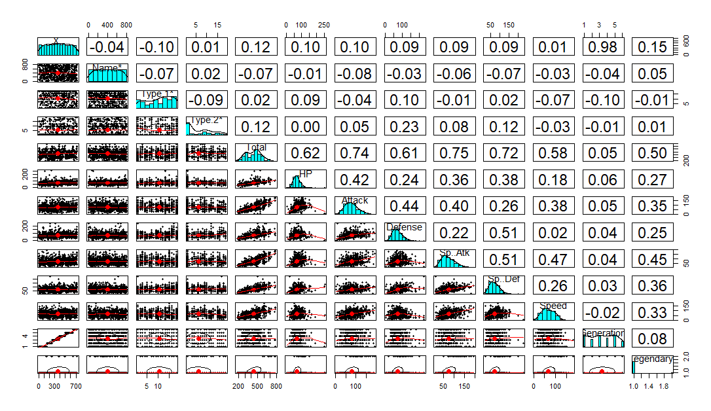
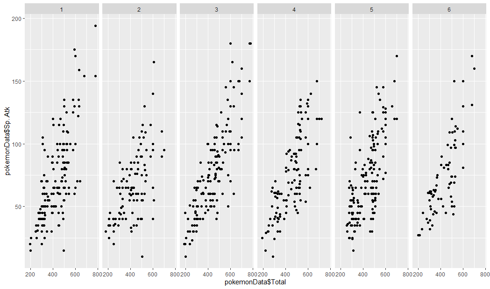
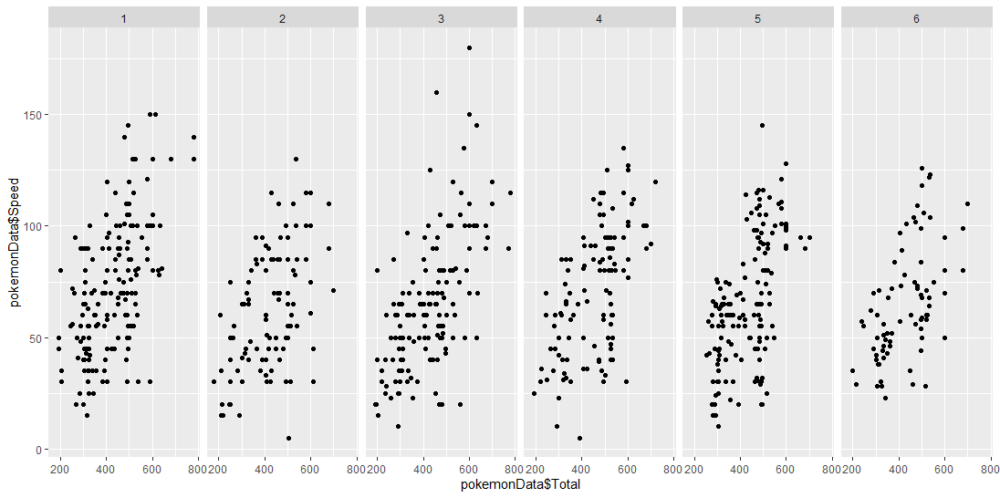

##### Name(s) : Kate Folkenroth and Noah Stape

##### Date : 12/11/20

##### Title : A Study of Pokémon Statistics: Is Pokémon Balanced?

# Introduction and Question

  As Ash Ketchum says, "I choose you!" (Pokémon the Movie, 2017). For over twenty years, Pokémon is an expansive gaming series from Nintendo in which players get to catch, choose, and duel with these animalistic creatures called Pokémon. The first games were debuted as Pokémon Green and Pokémon Red in Japan in 1996 (Britannica, 2020). By 2020, Pokémon has developed into a full franchise with a card game, merchandise, television shows, and multiple movies. One of it's most trendsetting games has been the mobile app Pokémon Go! which includes features using augmented reality and geocaching. Throughout all the variations of gameplay, the franchise has developed a large fanbase. Many fanatics of Pokémon often strive for the best Pokémon to create an undefeatable team. Things fans consider on this game are the statistics of their Pokémon like their heart points (HP), attack strength, defense strength, type, etc. Some fans also question the possibility to predict Pokémon types based off of a few statistics suggesting specific weak or strong types of Pokémon. Our research wanted is aimed at these types of questions along with ones about the design of the game, is Pokémon a balanced game?

  A stable definition of what a balanced game looks like must exist. There are a few different qualities of a balanced game. David Serlin claims that a game "is balanced if a reasonably large number of options available to the player are viable. (balance1)"  Another quality of a balanced game was stated by Jaime Griesemer who claims that a game should strike a "balance between predictability and randomness. (balance1)" There are many other criteria for a balanced game, though for the purpose of brevity, the previously mentioned two will have to suffice. We hope to answer whether or not Pokémon meets the criteria for a balanced game with this study of Pokémon statistics.

  From one of the largest data science sites, Kaggle, we identified a dataset labeled "Pokémon with stats" created by Alberto Barradas. This set included 721 Pokémon with various statistics such as their HP or attack number ranging all the way to generation 6. This dataset will allow us to compare every Pokémon's stats by what type the Pokémon is, which generation the Pokémon was introduced in, and whether or not the Pokémon is classified as a "legendary." A legendary Pokémon is generally more difficult to obtain than a non-legendary, so their stats are typically much higher. We will use these comparisons to decide whether or not Pokémon is balanced based on the previously mentioned criteria.

# Plots and Analysis

  

  Seeing as we are looking to compare many different factors, it makes sense to get a broad overlook of the relationships in the data. The pairs.panel function proves very useful for scenarios like this, so it is the first thing that we looked at. Above is a completely unfiltered pairs.panel of the entire dataset. There are a few correlations that stand out in this data. It makes sense to first look at the correlation between "Sp. Atk" and "Total," as they have the greatest positive correlation in the panel: 0.75. This suggests to us that given a higher special attack, a Pokémon's total stats are also higher. This makes sense for all of the stats vs the total, though it is most true for Special attack here. It is also worth mentioning that the correlation between speed and total is the lowest when comparing the individual stats to the total. This suggests that speed has less of an impact on a Pokémon's total stats than special attack does. This could mean that there are either plenty of powerful Pokémon with low speed, or plenty of weak Pokémon with high speed. Overall, this pairs.panel quickly displays that Pokemon is generally balanced, though this will require further investigation.

  
  

  ![Plot](images/
  ![Plot](images/
  ![Plot](images/
  ![Plot](images/
  ![Plot](images/

# Conclusion

  From all of our data, we have reached the conclusion that there are some correlations. Using this data in practice, players will still need to create teams with all kinds and levels of Pokémon to be successful. As from their iconic tagline and our data also shows that players really "Gotta catch 'em all."

# Works Cited

balance1:
https://digital.lib.washington.edu/researchworks/bitstream/handle/1773/22797/Jaffe_washington_0250E_11528.pdf?sequence=1&isAllowed=y

---
intro:
https://doaj.org/article/3f3167f1ab374acd82dd1dac54f43a71
Pokemon the Movie //
https://www.britannica.com/topic/Pokemon-electronic-game
