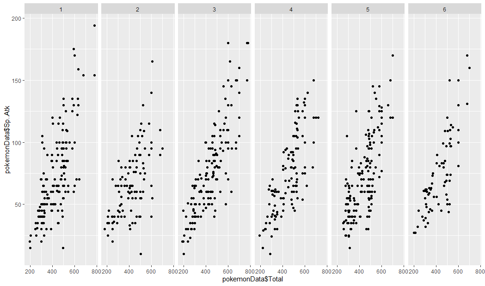
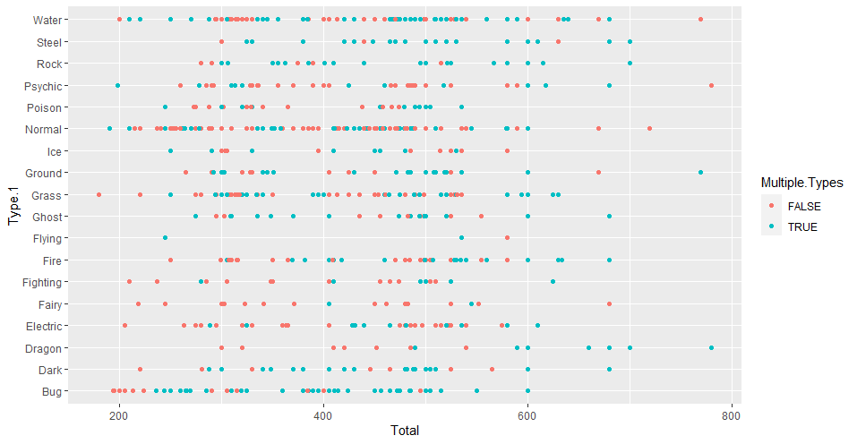
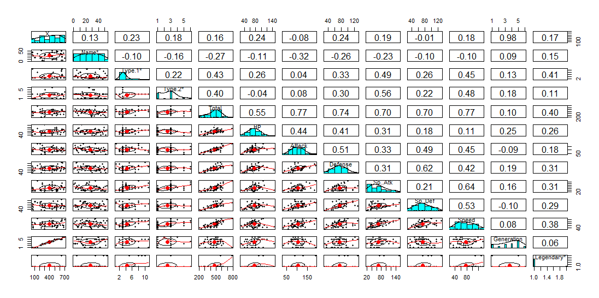
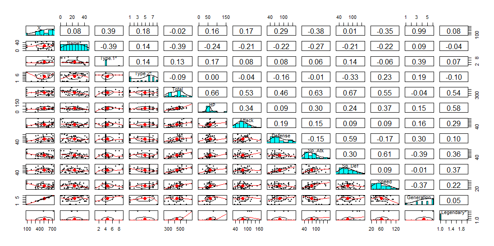
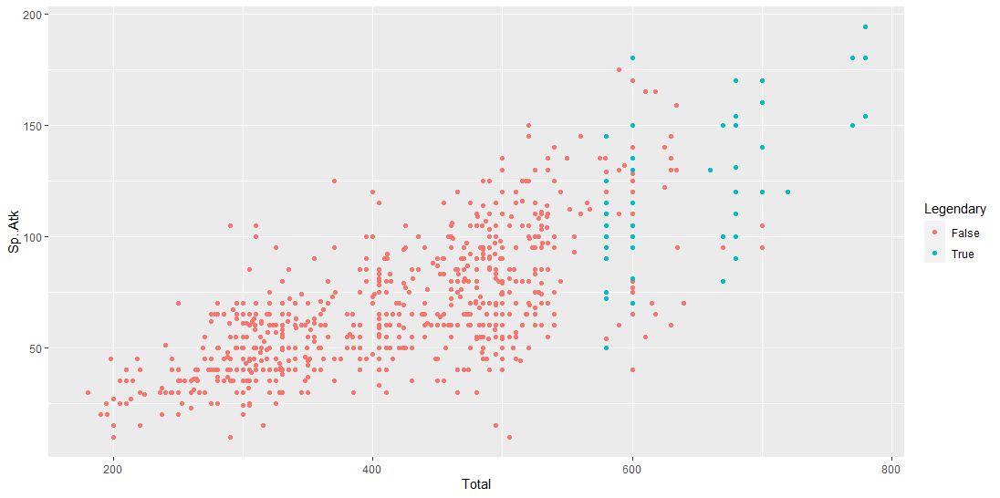

##### Name(s) : Kate Folkenroth and Noah Stape

##### Date : 12/11/20

##### Title : A Study of Pokémon Statistics: Is Pokémon Balanced?

# Introduction and Question

  As Ash Ketchum says, "I choose you!" (Pokémon the Movie, 2017). For over twenty years, Pokémon is an expansive gaming series from Nintendo in which players get to catch, choose, and duel with these animalistic creatures called Pokémon. The first games were debuted as Pokémon Green and Pokémon Red in Japan in 1996 (Britannica, 2020). By 2020, Pokémon has developed into a full franchise with a card game, merchandise, television shows, and multiple movies. One of it's most trendsetting games has been the mobile app Pokémon Go! which includes features using augmented reality and geocaching. Throughout all the variations of gameplay, the franchise has developed a large fanbase. Many fanatics of Pokémon often strive for the best Pokémon to create an undefeatable team. Things fans consider on this game are the statistics of their Pokémon like their heart points (HP), attack strength, defense strength, type, etc. Some fans also question the possibility to predict Pokémon types based off of a few statistics suggesting specific weak or strong types of Pokémon. Our research wanted is aimed at these types of questions along with ones about the design of the game, is Pokémon a balanced game?

  A stable definition of what a balanced game looks like must exist. There are a few different qualities of a balanced game. David Serlin claims that a game "is balanced if a reasonably large number of options available to the player are viable. (balance1)"  Another quality of a balanced game was stated by Jaime Griesemer who claims that a game should strike a "balance between predictability and randomness. (balance1)" There are many other criteria for a balanced game, though for the purpose of brevity, the previously mentioned two will have to suffice. We hope to answer whether or not Pokémon meets the criteria for a balanced game with this study of Pokémon statistics.

  From one of the largest data science sites, Kaggle, we identified a dataset labeled "Pokémon with stats" created by Alberto Barradas. This set included 721 Pokémon with various statistics such as their HP or attack number ranging all the way to generation 6. This dataset will allow us to compare every Pokémon's stats by what type the Pokémon is, which generation the Pokémon was introduced in, and whether or not the Pokémon is classified as a "legendary." A legendary Pokémon is generally more difficult to obtain than a non-legendary, so their stats are typically much higher. We will use these comparisons to decide whether or not Pokémon is balanced based on the previously mentioned criteria.

# Plots and Analysis

  

  Seeing as we are looking to compare many different factors, it makes sense to get a broad overlook of the relationships in the data. The pairs.panel function proves very useful for scenarios like this, so it is the first thing that we looked at. Above is a completely unfiltered pairs.panel of the entire dataset. There are a few correlations that stand out in this data. It makes sense to first look at the correlation between "Sp. Atk" and "Total," as they have the greatest positive correlation in the panel: 0.75. This suggests to us that given a higher special attack, a Pokémon's total stats are also higher. This makes sense for all of the stats vs the total, though it is most true for Special attack here. It is also worth mentioning that the correlation between speed and total is the lowest when comparing the individual stats to the total. This suggests that speed has less of an impact on a Pokémon's total stats than special attack does. This could mean that there are either plenty of powerful Pokémon with low speed, or plenty of weak Pokémon with high speed. Overall, this pairs.panel quickly displays that Pokémon is generally balanced, though this will require further investigation.

  
  

  The first plot above displays each Pokémon's special attack vs the total, separated by generation. The second plot displays speed vs the total, separated by generation again. While these charts are pretty similar in their overall looks, there is a clear difference between the two that reinforces the previously mentioned correlations between special attack and total, and speed and total. The data points on the speed plot are generally more spread out than the points on the special attack plot. The point of separating the data by generations is to determine whether there are any generational changes in the relationships. We can see that generation 3 features some more Pokémon with high speed and high special attack, though generally, there is not much difference between the generations. Because of the stability seen between generations, it can be assumed that there are very few generational differences in game balance.

  

  The next plot, displayed above, shows the total stats categorized by type, and colorized by whether or not the Pokémon is dual type. This is an important chart for this study as it displays a clear bias in the balancing of Pokémon. It is fairly clear that there are more dual type Pokémon towards the right side of the chart. Look right of total = 600. There is far more blue than orange, showing that the majority of high-strength Pokémon are dual type. It is clear that this bias exists, so does it effect how the game is balanced? The answer: sort of. Of course there is an unbalanced number of strong dual type and single type Pokémon, but this does not mean that the game is inherently unbalanced. While this single aspect of the game is unbalanced, there are so many other areas of the game that must be considered while making this determination. For instance, there must exist a balance between the strength of each type of Pokémon. Luckily this chart also tells us part of that story. One can see that besides a few outliers and a couple of types that are generally weaker, the Pokémon are fairly balanced. They are only balanced according to the criteria that a balanced game offers the player a large number of viable options. This study only goes into depth on stats, not move sets or type match-ups. We mention this because Pokémon is a complicated game with many aspects that we are not considering in this study.

###### Fighting
  
###### Ghost
  

  The above pairs.panels are for the Fighting and Ghost types of Pokémon. We are using these pairs.panels to show the difference in how certain types of Pokémon are balanced against each other. We chose to work with Fighting and Ghost specifically because of the differences between the two types. The assumption that we are trying to prove is that Ghost type is generally better at special attack, and Fighting is generally better at attack. To any seasoned player, this seems like a logical assumption. The results are a little more complicated than we thought, however. Looking into the Ghost pairs.panel proves our assumption. Both special attack and special defense have a higher positive correlation to the total than attack and defense. Looking at the Fighting panel provides a similar finding, but with attack and defense over special attack and special defense. The biggest difference between the two panels comes in the speed vs total box, where there is a 0.22 difference between the numbers for Fighting and Ghost. This shows that speed has less of an impact on the total for Ghost, while speed has more of an impact on the total stats for Fighting. This shows that there is a difference in how each type is balanced according to their stat distribution.

  This complicates our question as to whether or not Pokémon is balanced according to each Pokémon's stats, so we have to consider the key criteria for a balanced game. Does this impact whether or not the game has various viable options, and does this impact whether or not the game strikes a balance between predictability and randomness? I argue that this aspect of Pokémon does uphold these criteria for a balanced game. The fact that there is a difference between the general stats of Fighting and Ghost shows that each option is viable in its own way, in certain situations however. Whether or not the specific situation for the success of a Fighting or Ghost Pokémon is common or rare, the stats show that each type is viable, so the game is balanced in this way. The other criteria, striking a balance between randomness and predictability, is also satisfied by the stats. Let's look at the avg. correlation between all of the individual stats, and the totals. The avg. correlation for Fighting is 0.705, and the avg. correlation for Ghost is 0.583. This shows that the individual stats have less of an impact on the total stats for Ghost than they do for Fighting, showing that Ghost Pokémon are generally less predictable stats-wise than Fighting Pokémon. Because of this variation in predictability, we can assume that the rest of the types also feature varying levels of predictability. This creates an environment where experienced players can likely predict many aspects of a Pokémon based on its type, while novice players may be unable to. This seems like a balanced mechanism to us.

  

  The above plot displays every Pokémon's total stat vs special attack, while also isolating legendary Pokémon. The most interesting part of this plot is that the legendary Pokémon are separated from the rest. This shows us the significant statistical advantage that many legendary Pokémon have. One could theoretically create a team of only legendary Pokémon that would easily wipe the floor with regular Pokémon. This is perhaps the greatest imbalance we found when looking at this data. There are in game mechanisms built in to stop this from being the easiest route, however. Legendary Pokémon are notoriously difficult to catch in every Pokémon game. One generally only has a single chance to catch these legendary Pokémon before they disappear. This does not stop some people from running a team of only legendary Pokémon, though I am sure that it stops many from fully committing to the all-legendary lifestyle. Despite the gameplay mechanics that attempt to curb this, it is still the greatest imbalance we have found while looking into this data.

# Conclusion

  We have reached the conclusion that while legendary Pokémon throw the game's balance out of order a bit, the game is mostly balanced according to the criteria we used. Using this data in practice, players will still need to create teams with all kinds and levels of Pokémon to be successful. Our data shows that players really "Gotta catch 'em all."

# Works Cited

balance1:
https://digital.lib.washington.edu/researchworks/bitstream/handle/1773/22797/Jaffe_washington_0250E_11528.pdf?sequence=1&isAllowed=y

---
intro:
https://doaj.org/article/3f3167f1ab374acd82dd1dac54f43a71
Pokemon the Movie //
https://www.britannica.com/topic/Pokemon-electronic-game
